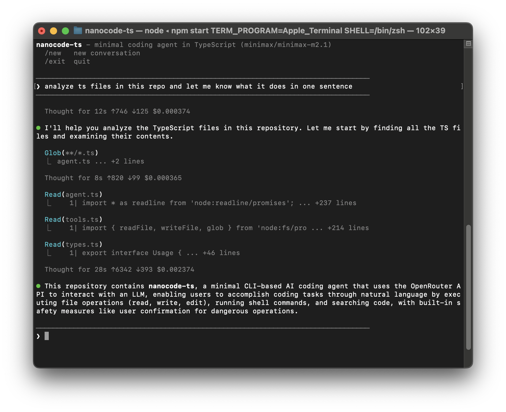

# nanocode-ts

**nanocode-ts** - a minimalistic coding agent implementation in TypeScript.



## Intention

This repo is for **my** learning purposes. If you'd like to learn how coding agents work, the best way is to use a coding agent like Claude Code and ask it to build a minimalistic implementation step by step. You can use a prompt like this:

> I'd like to understand how coding agents like Claude Code and Codex work. Please, create a plan on how to build a minimalistic coding agent step by step, so I can follow the plan.
>
> - For each step, mention what I will learn and how I can play with it to understand it better.
> - Make sure that code generated by the plan is straightforward and easy to understand.
> - Each step should bring me closer to the final result. Don't introduce tools or features that won't stay in the final version.
> - Please use TypeScript as I'm familiar with this language.
> - Use OpenRouter as LLM provider.
> - Don't introduce third-party libraries, only built-in node.js packages.

## Features

- Tools: `read`, `write`, `edit`, `glob`, `grep` and `bash`
- Colored terminal output
- LLM call stats: execution time, token usage, cost per call
- Safety:
  - Confirm execution of `bash` commands
  - Avoid infinite agentic loop

## Running

```bash
cp .env.example .env

# Set `OPENROUTER_API_KEY` inside `.env`

npm i

npm start
```

## Commands

- `/new` - Clear conversation
- `/exit` - Quit

## Inspiring Resources

- [nanocode](https://github.com/1rgs/nanocode) - Python implementation of a minimal coding agent in ~250 lines of code from [Rahul](https://x.com/rahulgs).
- [Deep Dive into LLMs like ChatGPT](https://www.youtube.com/watch?v=7xTGNNLPyMI) - the best video explaining how LLMs work by [Andrej Karpathy](https://x.com/karpathy) - a must-watch.

## License

MIT
